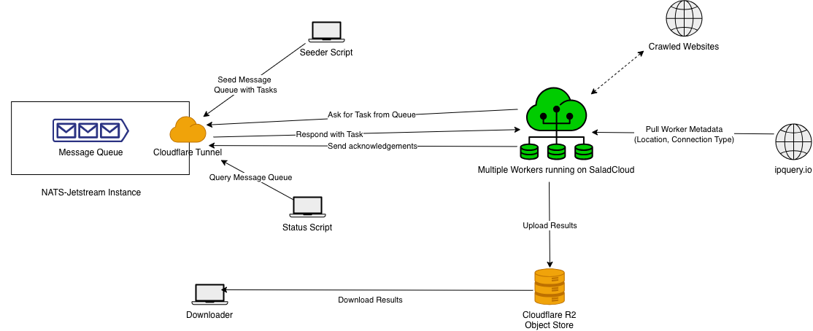

[](https://doi.org/10.5281/zenodo.19613035)
# distcrawl

Distributed web crawler built on NATS JetStream and Playwright. Workers pull tasks from the queue, visit pages, and save network traffic to the object store as Parquet files.

## Documentation

To read more about each part of the crawler, check their `README`-files:

- [worker/README.md](worker/README.md)
- [scripts/README.md](scripts/README.md)
- [analysis/README.md](analysis/README.md)
- [common/README.md](common/README.md)
- [tests/README.md](tests/README.md)

## Prerequisites

- Docker and Docker Compose (for worker and nats jetstream)
- `uv` for running scripts
- [Rill](https://github.com/rilldata/rill) to analyze the completed experiments.

## Local Setup

Start NATS:
```bash
docker compose -f docker-compose.hub.yml up -d
```

Start the worker:
```bash
docker compose -f docker-compose.worker.yml up -d
```

Install script dependencies:
```bash
uv sync
```

You can specify endpoints / behaviours of the crawler by specifying environment variables in `.env`.
For that, just copy `.env.example` to `.env` and adjust the variables you need. I added comments to explain what each one of the variables does.
The default values should work for local development.

## Running an Experiment

1. Fetch and cache the Tranco list (only needed once):
```bash
uv run python scripts/fetch_tranco.py
```

2. Seed the queue with URLs:
```bash
uv run dist-seed --accept-cookies --no-navigate --depth 0 --dwell-seconds 30 --scroll-amounts 0 --num-tranco 5000 --browser chromium --no-headless example
```

3. Check the progress:
```bash
uv run dist-status
```

4. Download and post-process results:
```bash
uv run dist-download
```

5. Analyze the results:
```bash
cd analysis && rill start
```

> After the model is built by Rill, you can connect a DuckDB client to `tmp/default/duckdb/main.db` for further analysis.

## Running Tests

Run all tests (unit tests + e2e tests):
```bash
uv run pytest tests/
```

Run only unit tests:
```bash
uv run pytest tests/scripts/ tests/worker/
```

Run e2e tests (requires Docker Compose):
```bash
uv run pytest tests/e2e/
```

## Deploying to the Cloud

Scraping thousands of URLs benefits greatly from horizontal scaling, so for larger crawls it is a good idea to work with a large number of parallel nodes.
Reliability of the nodes is not a high priority (NATS automatically redelivers failed tasks), so AWS Spot Instances or Distributed Clouds like [Salad](https://salad.com) can be used to keep the costs low.
See [worker/README.md](worker/README.md) for more details on how to distribute to multiple nodes.


### Architecture diagram

Here is a high-level overview of the architecture I used to deploy the crawler to the cloud.




## License

MIT
