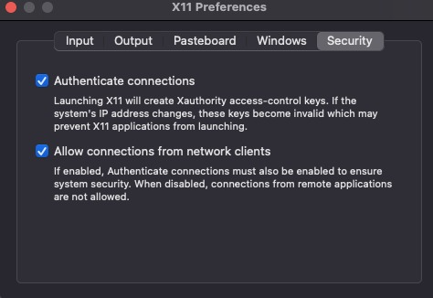
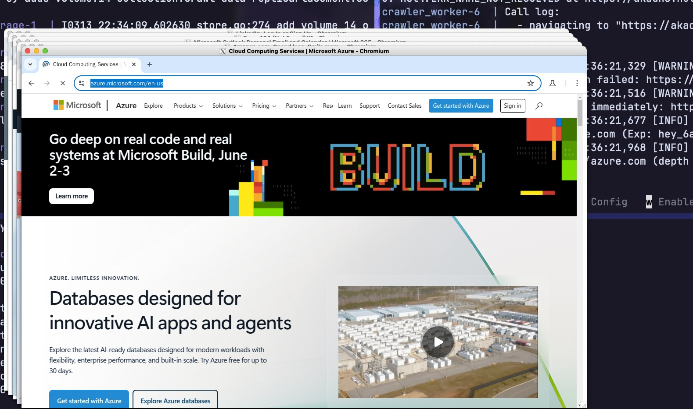

# distcrawl Worker

The worker is the actual crawler.
It pulls tasks from NATS, runs them in Playwright (using the experiment parameters that we specified while seeding), and saves the results to `.parquet`-files.

## Local Setup

* If necessary, adjust replica count (see below).
* Run it using `docker compose -f docker-compose.worker.yml up -d`

## Behaviour of a worker-instance

* An instance of worker spawns multiple independent browser contexts (crawlers).
* If you specify the worker to be headless, it will respect that. Otherwise, the default behaviour is to run headful and redirect their output to a virtual x-buffer using `xvfb` (or your own x-server, see "debugging"-section below).
* If an experiment has `--accept-cookies` enabled, we inject a script into the context that tries to find and click the `Accept all`-Button of any cookie warning it might come across.
* Using `--navigate` and `--depth=INT` you can specify how deep the crawler should navigate. To do this, it keeps clicking hyperlinks that go to different subpages, until the specified depth is reached. The `--dwell-seconds` parameter is applied to each subpage, so for example a value of 10 would result in 20 total dwell seconds if we navigate to a depth of 1.

## Acknowledgement behaviour

To make sure every URL in the queue is scraped, the worker only marks a task as `done` after it is successfully written to the object store.
This means the same URL might be processed multiple times, but none of them will be missed (at least once guarantee).
We account for this in the `dist-download`-script and deduplicate the data after downloading.

### Automatic Redelivery of failed tasks

NATS automatically re-delivers a task to a worker if it has not been marked as done after the timeout. After a few unsuccessful tries, the task is moved to a separate "Dead Letter Queue".
To prevent it from re-delivering a task while it is still being worked on, the worker will send a "heartbeat" to NATS every few seconds, reporting what it is working on.

# Scaling workers

## Configuration options

* `ONLY_ALLOW_RESIDENTIAL_CONNECTIONS`: If set to `TRUE`, the worker will check its IP against `ipquery.io` and abort if it detects a VPN, proxy, or datacenter IP. This is useful for avoiding bot detection on residential-only crawls.

## Adjusting amount of workers / crawlers on a single node

To run multiple worker instances on the same node, just increase the `replicas: 1`-parameter to something higher in `docker-compose.worker.yml`.
The number of crawlers in a node can be specified in the `NUM_CRAWLERS` env-var.
Make sure to test your configuration properly, because overloading the node might mean timeouts / dropped connections if the CPU cannot load the resources fast enough.

## Distributing workers to multiple nodes

To run workers on multiple nodes, one way is to install a Mesh-VPN like [Tailscale](https://tailscale.com) or [ZeroTier](https://www.zerotier.com) to establish communication between the worker nodes and the NATS instance.
Then, simply modify the environment variables of the workers to point at the internal / assigned IP adress of the node running NATS (`docker-compose.hub.yml`).

Another method would be exposing the NATS to the public internet using port forwarding or Cloudflare Tunnel. Then configure the workers to point at the public IP of the NATS instance.

I included `cloudflared` in the `docker-compose.hub.yml` file and tagged it with profile `cloudflare_tunnel`.
To use it:
1. Create a new Cloudflare tunnel using internal URL `http://nats:8080` and set the secret token as `CLOUDFLARE_TUNNEL_TOKEN` in `.env`.
2. Change `NATS_URL` to `wss://public_subdomain.tld`
3. Generate a strong `NATS_TOKEN` and set it as `NATS_TOKEN` in `.env`. Since you are exposing NATS to the public internet, anyone who knows this will have access.
2. Then run `docker-compose -f docker-compose.hub.yml up --profile cloudflare_tunnel`.

# Debugging (on macos)

To watch the browser inside docker on macos, we have to forward the x-buffer:

1. Install XQuartz using Homebrew: `brew install --cask xquartz`
2. Enable "Allow connections from network clients" in settings.

3. Run `xhost +localhost` to grant access to your display.
4. Uncomment `DEBUG_DISPLAY` in `.env`.

I recommend keeping `replicas`-setting at 1 so that your screen is not flooded with too many windows. This is what it should look like:

# Changing the browser engine

Changing the browser engine can be done by editing `BROWSER_TYPE` env var.

# Remaining Challenges

* Because we are scraping so many websites (and using a vanilla playwright-controlled browser), bot detection has a really easy time to find us. In my experience, even testing it out a few times could trigger Cloudflare challenges / make `google.com` unavailable. This happens often especially when behind a vpn.
* Rendering the full DOM for multiple websites in parallel is really CPU-intensive, but necessary if we want to catch scripts that run only in headful mode (like canvas-fingerprinting).

## Solutions to these Challenges

Instead of running the full crawl on a single machine, distributing the tasks across a network of nodes allows us to solve these problems:
* Instead of running too many crawlers on a single worker, we can increase the number of worker nodes instead, which means we can use a larger number of weak crawlers. In my testing, I found that 2vCPU with 4GB RAM is enough to run 5 parallel crawlers.
* Using multiple nodes also means the IP of the crawler will not stay constant, so we do not get blocked nearly as often.
* If using SaladCloud, most nodes will be using their residential IP address (in my testing, only around 3% of them are using a vpn connection). This means blocking based on IP is not a concern.
